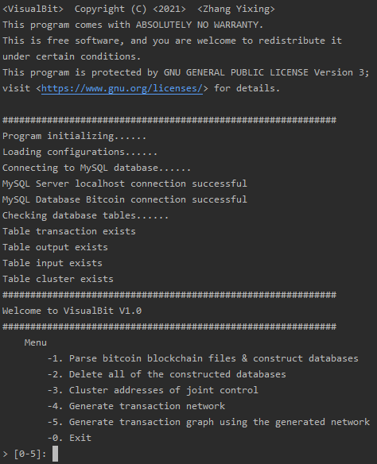
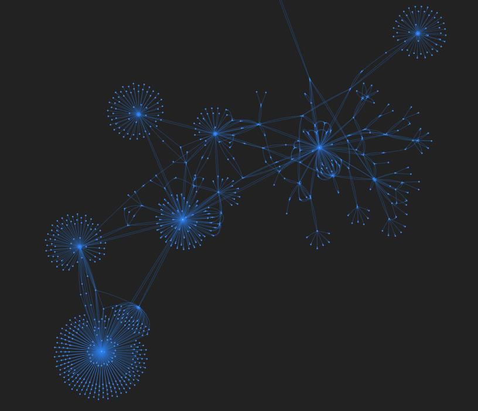
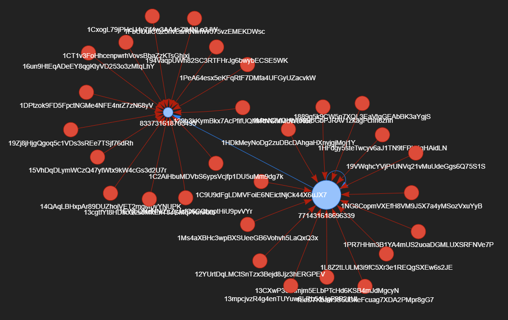
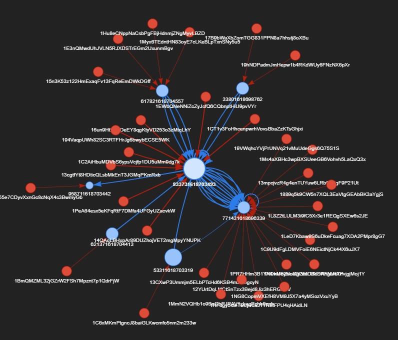

# VisualBit
This project is my undergraduate final year project fyp20059 in HKU.  

## Introduction
**VisualBit** is a tool to facilitate the analyses of Bitcoin transactions. It supports the following features:

+ ***Parser*** :  
    Parse the raw data stored by [Bitcoin Core](https://bitcoin.org/en/bitcoin-core/) (in blk*.dat files).
+ ***Database Management*** :  
    Construct and maintain a database for the transactions and address cluster info.
+ ***Address Clustering*** :  
    Group the addresses of joint control into different clusters.
+ ***Transaction Network Construction*** :  
    Construct a transaction network using the database.
+ ***Transaction Graphs Generation*** :  
    Generate two types of transaction graphs using the constructed network.
    + Address-centered graph:  
        addresses as nodes, connected by directed edges to represent transactions.
    + Entity-centered graph:  
        entity as nodes which consists of addresses in the same cluster, connected by directed edges to represent 
        the transactions between entities.
      
## Getting started
### 1. Getting source codes
+ Use Git :
  ```shell
  git clone https://github.com/Yixing-Zhang/VisualBit.git
  ```
+ [Download Zip](https://github.com/Yixing-Zhang/VisualBit/archive/refs/heads/main.zip) :  
    Unzip the files into your disk.
  
### 2. Installing dependencies
This project is developed with Python 3.9.  

Go to the project folder.  

Project requirements :
+ networkx~=2.5.1
+ bitcoin==1.1.42
+ mysql_connector_repackaged==0.3.1
+ pyvis==0.1.9
+ mysql~=0.0.2
+ mysql-connector-python~=8.0.23

Install dependencies contained in requirements.txt:
```shell
pip install -r requirements.txt
```

### 3. Installing MySQL
This program will make use of **MySQL 8**. It can be downloaded 
[here](https://dev.mysql.com/downloads/windows/installer/8.0.html).  

Follow the instructions of installer program to install it on your computer and set up a local MySQL server. Remember 
your **username** and **password** which will be used later to modify **config.json**.

### 4. (Optional) Getting Sample Database
A [sample MySQL database](https://drive.google.com/drive/folders/1y1CIbFniqIpzj9_9rF8PVeypW4G1C6J3?usp=sharing) 
based on blk00000.dat and part of blk00001.dat is provided in case you only want to play 
with the program and do not want to wait (the parsing and clustering can be very time-consuming).  

To restore the sample database:  
1. [Download](https://drive.google.com/drive/folders/1y1CIbFniqIpzj9_9rF8PVeypW4G1C6J3?usp=sharing) the sample files.
2. Open **MySQL Workbench** (use search bar if you can't find it) and connect to your MySQL server **localhost**. 
3. Go to the **Administration** section under **Navigator** bar, and select **Data Import/Restore**.
4. Load the databases you download under **Sample Database** folder in **Import Options** and select **all** the 
   database objects.
5. Start import.
6. Copy **parsed_logs.txt** into the project root.

If you do not copy the **parsed_logs.txt**, the program will try to parse blk00000.dat again getting a lot of error 
messages. You should copy it to avoid this. However, the program still gives error messages when parsing blk00001.dat 
even with logs under root. This is 
because blk00001.dat is only partially constructed and therefore it is not marked as being parsed in logs. Please 
ignore the messages.

### 5. Getting Bitcoin Raw Data
If you do not have blk*.dat raw data files, please download [Bitcoin Core](https://bitcoin.org/en/download) and 
install it. Run the software, and you will get the raw data files.  

Then please put the blk*.dat files you want to parse and to construct transaction network on into the folder 
**example_bitcoin_data** under the root.  

:exclamation: Please **ONLY** put the files you want to parse into the folder. Because the program will process 
**all** the blk*.dat files under it, it is **not** recommended putting something you do not need. But you can keep 
them there after processing since the program keeps a log file to remember which blk*.dat files have been processed. 
You can always add new files to the folder.

### 6. Updating Configurations
This project keeps configurations in **config.json**.  

Here are the details for the JSON:  

| Field | Sub-field | Description |
| :-----: | :----: | :---- |
| <span style="color:#E77471">**db**</span> | | Configurations for database |
| | <span style="color:#7D0552">**host**</span> | Database host |
| | <span style="color:#7D0552">**user**</span> | Database server user name |
| | <span style="color:#7D0552">**password**</span> | Database server password |
| | <span style="color:#7D0552">**dbName**</span> | Database name to connect |
| <span style="color:#E77471">**dp**</span> | | Configurations for data path |
| | <span style="color:#7D0552">**block_path**</span> | Absolute path to where the blk*.dat files to be processed are|
| | <span style="color:#7D0552">**log_path**</span> | Absolute path to where the log file are|

Please replace the **user** and **password** fields with your own. You can also change the **dbName** if you want 
a different database name. But if you are using the sample database, **DO NOT** change the name!  

Modify **block_path** field to your **absolute path** of **example_bitcoin_data** folder under project root,  
e.g. C:/VisualBit/example_bitcoin_data  

Change **log_path** field to your **absolute path** to your **project root + parsed_logs,txt**,  
e.g. C:/VisualBit/parsed_logs.txt

### 7. Run Main Program
You are all set!  

Please run **VisualBit.py** to start the program:
```shell
python VisualBit.py
```

## Usage
After starting the program, you will get into the main menu with 6 options:



Select an option to run the corresponding function:

+ Option 1: Parse the blk*.dat files and store into the database.
+ Option 2: Drop all the tables in database.
+ Option 3: Cluster the addresses in the local database.
+ Option 4: Construct the transaction network for generating graphs using the local database.
+ Option 5: Generate the interactive transaction graphs using the constructed network.

### Address Cluster
To cluster addresses, please **MAKE SURE** you have a constructed database of transactions.  

There are two methods for cluster:  

+ Common Spending (CS)
+ One-time Change (OTC)

#### 1. Common Spending
The most straightforward idea for grouping Bitcoin addresses of joint ownership is marking all the input addresses of 
a transaction as belonging to one entity. Only the addresses of joint control can be used to pay in a transaction 
because the private keys for the addresses are needed to sign on the transaction. Therefore, when a transaction has 
many inputs, we can conclude they should all belong to one group.

#### 2. One-Time Change
The *unspent transaction output* (UTXO) change of a transaction will go to a new address by design, which should also 
belong to the input addresses' owner. The dilemma is to find this change address from the outputs. Many wallet software 
puts the change address in the last position while some arrange the output sequence randomly. One possible solution is 
to mark the transaction which has only one output as a “change transaction”, which means its input addresses and output 
addresses belong to the same entity because it is very unlikely that the inputs have the exact amount of UTXO paid to 
the output. The transactions with one output can be seen as the owner is reallocating the UTXO.

### Transaction Network Construction
To construct a transaction network, please **MAKE SURE** you have a constructed database of transactions.    

The program will ask for a Bitcoin **address** as the network center (the transactions will be related to the address).  

Since the database is only partial in the most time, you need to **MAKE SURE** the address is in the database and is 
valid, otherwise the program will give a **NOT FOUND** or **INVALID** result. If you are using the sample database, 
you can try the address:  

```
13mpcjvzR4g4enTUYuw6LRb51UgF9P21Ut
```

The program will also need an input as the **Level of Layer (LL)**.  

LL is the distance between the farthest addresses and the center address (how many layers around the center address). 
It is recommended to be in the **range of [1-5]**, because too many layers will result in too many nodes, which is 
slow to be rendered into graphs.  

### Transaction Graphs Generation
To generate transaction graphs, please **MAKE SURE** you have constructed the network.  

There are three types of graphs:  

+ Address-centered graphs
+ Entity-centered (full-version) graphs
+ Entity-centered (simplified) graphs

All the graphs generated are stored in **graphs** folder and are interactive, you can open the sample graphs in the 
folder to have a try. The nodes may be bouncing when they are too crowded. In that case, you can try to reduce the 
parameter *gravitationalConstant* in the physics bar.

#### 1. Address-Centered Graphs
In the address-centered graphs, blue nodes represent the addresses. The edges between nodes stand for 
transactions between them with direction. The more transactions an address has, the bigger its node will be.  

An example for address *13mpcjvzR4g4enTUYuw6LRb51UgF9P21Ut* with 4 layers:  



#### 2. Entity-Centered (Full-Version) Graphs
For the full version of the entity-centered graph, all the addresses belonging to the entity will be drawn as small 
nodes, each connecting to the big node: entity, indicating they are in the same group. However, this is not a good 
graph to render when the nodes are too much. It will be extremely slow to display in the software. Therefore, a 
simplified version is introduced by the project.  

An example for address *13mpcjvzR4g4enTUYuw6LRb51UgF9P21Ut* with 1 layer: 



#### 3. Entity-Centered (Simplified) Graphs
The simplified version does not include all the addresses. Instead, it only renders those that are inputs or outputs of 
the transactions, which reduces the number of nodes significantly making it possible to generate larger graphs.  

An example for address *13mpcjvzR4g4enTUYuw6LRb51UgF9P21Ut* with 2 layer: 



## Possible Future Updates
1. **Internet based method for transaction network construction function :**  
   Make use of <https://blockchain.info/q>'s API to get transaction data. This can save us from parsing locally when we 
   do not need much cluster info. Update soon.
2. **GUI implementation :**  
   Current console version is not beautiful and friendly to interact. Needs some time.
3. **Parser & cluster efficiency improvement :**  
   Current parser and cluster are very slow due to massive I/O operations on database. Optimizing program logics and 
   SQL statements may help. This one is tricky and therefore a long-term goal.

## License
Distributed under the GNU License. See LICENSE for more information.  

    VisualBit - A tool to facilitate the analyses of Bitcoin transactions
    Copyright (C) <2021>  <Zhang Yixing>

    This program is free software: you can redistribute it and/or modify
    it under the terms of the GNU General Public License as published by
    the Free Software Foundation, either version 3 of the License, or
    (at your option) any later version.

    This program is distributed in the hope that it will be useful,
    but WITHOUT ANY WARRANTY; without even the implied warranty of
    MERCHANTABILITY or FITNESS FOR A PARTICULAR PURPOSE.  See the
    GNU General Public License for more details.

    You should have received a copy of the GNU General Public License
    along with this program.  If not, see <https://www.gnu.org/licenses/>.

    Email: u3544946@connect.hku.hk

## Contact
Email: <u3544946@connect.hku.hk>  

Project link: https://github.com/Yixing-Zhang/VisualBit

## References
[1] T.-H. Chang and D. Svetinovic, "Improving bitcoin ownership identification using transaction patterns analysis," 
IEEE Transactions on Systems, Man and Cybernetics: Systems, no. 99, pp. 1–12, 2018.  
[2] M. Fleder, M. S. Kester, and S. Pillai, "Bitcoin Transaction Graph Analysis," arXiv:1502.01657v1 [cs.CR], Feb. 2015.  
[3] S. Foley, J. R. Karlsen, and T. J. Putniņš, "Sex, Drugs, and Bitcoin: How Much Illegal Activity Is Financed through 
Cryptocurrencies," The Review of Financial Studies, Vol. 32, pp. 1798-1853, May 2019.  
[4] M. M¨oser, R. B¨ohme, and D. Breuker, "An inquiry into money laundering tools in the bitcoin ecosystem," in 2013 
APWG eCrime Researchers Summit. Ieee, 2013, pp. 1–14.  
[5] Bitcoin core. (n.d.). Bitcoin core. [Online]. Available: https://bitcoin.org/en/bitcoin-core/ 
[Accessed: 2020, Sep 24].  
[6] A. M. Antonopoulos, Mastering Bitcoin. Sebastopol: O'Reilly Media, 2014.  
[7] K. Vaidya. (2016, December 8). Bitcoin's implementation of Blockchain [Online]. Available: 
https://medium.com/all-things-ledger/bitcoins-implementation-of-blockchain-2be713f662c2 [Accessed: 2020, Sep 24].  
[8] D. Ermilov, M. Panov and Y. Yanovich, "Automatic Bitcoin Address Clustering," 2017 16th IEEE International 
Conference on Machine Learning and Applications (ICMLA), Cancun, 2017, pp. 461-466, doi: 10.1109/ICMLA.2017.0-118.  

## Acknowledgment
I would like to express my greatest gratitude here to all the people who have provided supports during the project, 
especially the project supervisor, Dr. Au Allen, for his guidance on blockchain in terms of giving suggestions and 
providing related materials.